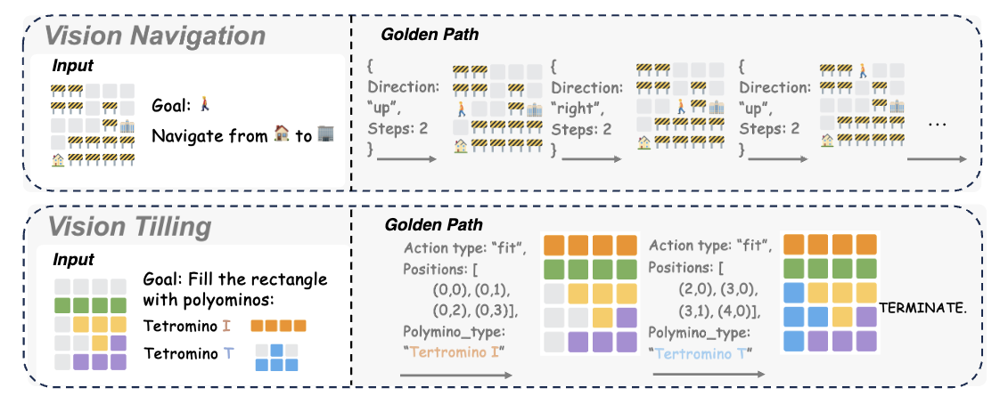

# VisuoThink: Empowering LVLM Reasoning with Multimodal Tree Search

Recent advancements in Large Vision-Language Models have showcased remarkable capabilities. However, they often falter when confronted with complex reasoning tasks that humans typically address through visual aids and deliberate, step-by-step thinking. While existing methods have explored text-based slow thinking or rudimentary visual assistance, they fall short of capturing the intricate, interleaved nature of human visual-verbal reasoning processes. To overcome these limitations and inspired by the mechanisms of slow thinking in human cognition, we introduce **VisuoThink**, a novel framework that seamlessly integrates visuospatial and linguistic domains. **VisuoThink** facilitates multimodal slow thinking by enabling progressive visual-textual reasoning and incorporates test-time scaling through look-ahead tree search. Extensive experiments demonstrate that **VisuoThink** significantly enhances reasoning capabilities via inference-time scaling, even without fine-tuning, achieving state-of-the-art performance in tasks involving geometry and spatial reasoning.



## Quick Start

```bash
pip install -r requirements.txt
```

- To run the visual navigation with VisuoThink, you can use the following command:

```bash
python visual-navigation/run_task_nav.py --verbose --visual
# alternatively, you can use the --tree_search flag to enable multimodal tree search
```

- To run the visual navigation with CoT with Executor, you can use the following command:

```bash
python visual-navigation/run_task_nav.py --verbose
```

- To run the visual navigation with CoT, you can use the following command:

```bash
python visual-navigation/run_task_nav.py --verbose --visual --run_tag cot
```


## Citation
Please consider citing our paper and starring this repo if you find them helpful. Thank you!
```bibtex
@article{wang2025visuothink,
         title={VisuoThink: Empowering LVLM Reasoning with Multimodal Tree Search},
         author={},
         journal={},
         year={2025}
}
```